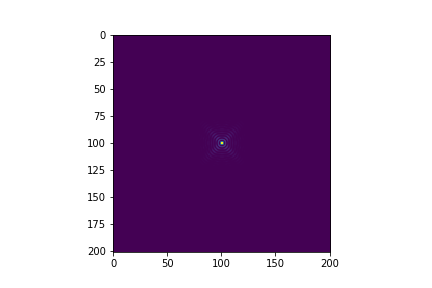
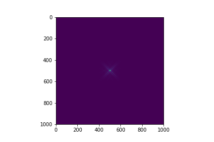
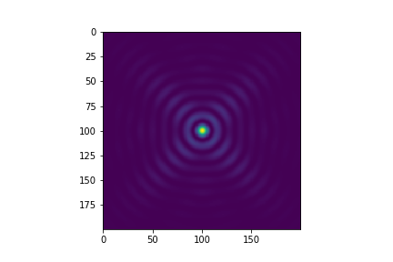

# Overview

此为 *实验物理的大数据方法（2）* 课程第二阶段大作业： **ISOENERGY** 的评测平台。

关于该作业的物理背景及简介，可以参见 [第一阶段作业](https://github.com/physics-data/tpl_isoenergy) 。

本阶段中的任务是从给出的实空间数据，找出对应的动量空间数据。涉及到 **HDF5** 的读取和写入，以及推导转换过程所需要的公式或者方法（比如DeepLearing）。本阶段不限制使用的编程语言、第三方库或者工具软件。

训练与测试用的数据可以从 [清华云盘](https://cloud.tsinghua.edu.cn/d/bcc7b8e657e94183b123/) 下载，其中`training.h5` 是训练数据，`problem.h5 ` 是评测数据(没有`isoE` 这个dataset)。评测数据是使用与训练数据相同的参数与方法生成的。具体产生细节见后续介绍。

# Data Generation Process

用于评测的 `problem.h5` 以及 `training.h5`中的 dataset `QPI` 的数据都是通过同一份程序产生，输入的数据是不同的动量空间数据，例如 `training.h5`中的 dataset `isoE` 的数据。

对于某一个动量空间的矩阵，对应图像如图

使用的转换过程仅考虑无磁性情况下，对于动量空间 $f(k)$ 为实数的情况下，可以推导出实空间公式为

$$
D(\mathbf{r}) = A^3+3A*\left|B\right|^2
$$

其中 
$$
A=\int \mathrm{d}\mathbf{k} f(\mathbf{k}),\,\,B=\int \mathrm{d}\mathbf{k} f(\mathbf{k})e^{-i\mathbf{k}\mathbf{r}}
$$

在离散的矩阵中，对于 A 的计算可以采用 **FFT** 加速，对应于二维 **FFT** 变换的公式如下
$$
B(v,u)=\sum_{m=0}^{200}\sum_{n=0}^{200} f(\mathbf{m,n})e^{-j2\pi{\frac{vm+un}{N}}}
$$

可以只采用 $N=200$ 进行 **FFT** 变换，但是结果会很小，由于像素点个数只有 $201\times 201$，因此放大图像会失真

为了得到更精细的结果，程序将 **FFT** 变换的长度变为原来矩阵大小的 5 倍，即 $N=1005$。为了将变换位置放置在图像中心，程序利用 `fftshift` 将矩阵进行了圆周位移。

可以取中间部分的 $201\times201$ 个点放大查看：

数据生成程序位于 [清华 Git](https://git.tsinghua.edu.cn/zaq15/isoenergy/blob/master/scatter.py)。

# Data Format

从上述程序转换过程中可以注意到对应的数据格式如下：

`training.h5` 由 9000 个 group 组成，每个 group 包含两个 dataset : `isoE`, `QPI`。

`problem.h5` 由 900 个 group 组成，每个 group 包含一个 dataset :  `QPI`。

`example.h5` 由 900 个 group 组成，每个 group 包含一个 dataset : `isoE`。你提交的文件应该要和这个样例文件一致。

其中 `isoE` 的矩阵形状为 $(201, 201)$，`QPI` 的矩阵形状为 $(1005, 1005)$。

# Evaluation

评分算法采用 **L2** 距离，假定你的提交为 $f_{sub}$，标准结果为 $f_{ans}$，计算公式如下
$$
D_{L_2}=\sum_{i}\sum_{j}{\sqrt{{(abs({f_{sub}-f_{ans}}))}^2}}
$$

因此你的提交越接近真实结果，评测试用的 **L2 **距离越小。

在线评测采取排位形式，同学们将计算结果按照**规定的格式**提交到 Submissions，平台将自动计算你所提交的结果同标准结果之间的 L2 距离，此距离越 **小**，表示和标准结果符合得越好。最终此部分成绩保证是排名的严格递减函数。

在线评测的结果作为作业总成绩中的黑盒部分，占 80%。你需要在 GitHub Classroom 上接受相应的作业，并在仓库中提交你的代码和任何用于运行的额外内容（如脚本、Makefile 等）。你的结果必须是可复现的，否则黑盒成绩将被酌情扣减（甚至取消）。

白盒部分占剩余的 20%。分为 Git 使用（5%）、代码风格（5%）与实验报告（10%）。在实验报告中，需要包含以下内容：

+ 处理算法的核心思想（包括必要的数学推导、文献引用等）
+ 代码整体结构与思路
+ 遇到的问题及解决方法
+ 代码的运行方式（特别是使用了额外的软件包或者需要较复杂的配置时）

# Resources

若有任何疑问，还可以在 讨论区 发帖交流，或者联系教学团队。

